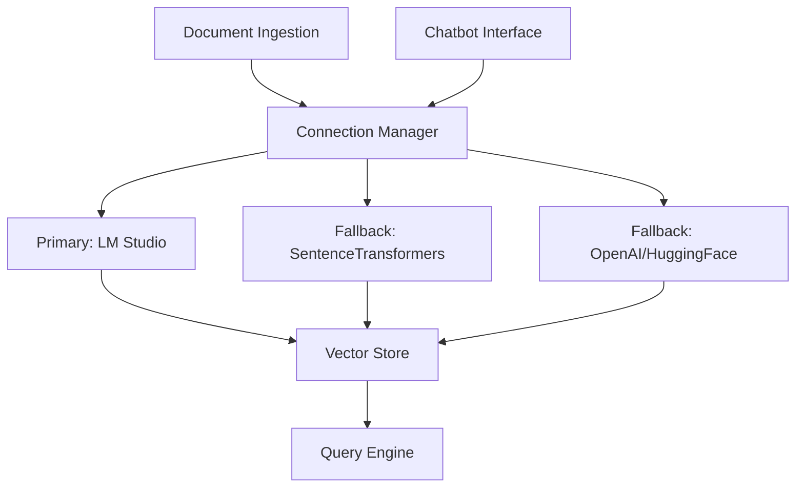

# Design Document

## Overview

This design implements a robust, fault-tolerant RAG system that gracefully handles embedding service failures through automatic fallback mechanisms, comprehensive error handling, and flexible service configuration. The solution addresses the current 404 errors from LM Studio by implementing a multi-tier embedding service architecture with intelligent connection management.

## Architecture

### High-Level Architecture



### Service Hierarchy

1. **Primary Service**: LM Studio (http://127.0.0.1:1234/v1/embeddings)
2. **Local Fallback**: sentence-transformers models (offline capability)
3. **Remote Fallback**: OpenAI/HuggingFace APIs (optional, configurable)

## Components and Interfaces

### 1. Connection Manager

**Purpose**: Centralized service health monitoring and automatic failover

**Key Methods**:
```python
class ConnectionManager:
    def get_active_embedding_service() -> EmbeddingService
    def health_check(service: str) -> ServiceStatus
    def switch_service(target: str) -> bool
    def get_service_priority_list() -> List[str]
```

**Responsibilities**:
- Monitor service health with configurable intervals
- Implement exponential backoff (base: 2s, max: 30s, max_retries: 5)
- Log all connection attempts and failures
- Maintain service availability cache (TTL: 60s)

### 2. Enhanced Embedding Service Wrapper

**Purpose**: Unified interface for multiple embedding providers

**Key Methods**:
```python
class UnifiedEmbeddingService:
    def embed_documents(texts: List[str]) -> List[List[float]]
    def embed_query(text: str) -> List[float]
    def get_dimension() -> int
    def validate_compatibility() -> bool
```

**Service Implementations**:
- `LMStudioEmbeddingService`: Enhanced version of current wrapper
- `SentenceTransformerService`: Local sentence-transformers integration
- `OpenAIEmbeddingService`: OpenAI API integration (optional)

### 3. Fallback Embedding Services

#### Local Sentence Transformers
- **Model**: `all-MiniLM-L6-v2` (384 dimensions, fast)
- **Backup Model**: `all-mpnet-base-v2` (768 dimensions, higher quality)
- **Storage**: Local model cache in `.cache/sentence-transformers/`

#### Configuration Priority
1. Check LM Studio availability
2. If unavailable, use local sentence-transformers
3. If configured, attempt remote APIs as final fallback

### 4. Enhanced Error Handling

**Error Categories**:
- **Connection Errors**: 404, Connection Refused, Timeout
- **Authentication Errors**: 401, 403
- **Rate Limiting**: 429, 503
- **Service Errors**: 500, 502, 504

**Retry Strategy**:
```python
def exponential_backoff(attempt: int) -> float:
    base_delay = 2.0
    max_delay = 30.0
    jitter = random.uniform(0.1, 0.5)
    return min(base_delay * (2 ** attempt) + jitter, max_delay)
```

### 5. Vector Store Compatibility

**Dimension Handling**:
- Detect existing embeddings dimension in ChromaDB
- Warn users when switching between different dimension models
- Support multiple collections for different embedding dimensions

**Migration Strategy**:
- Create new collection if dimensions don't match
- Preserve existing data in original collection
- Provide utility to re-embed documents with new service

## Data Models

### Service Configuration
```python
@dataclass
class EmbeddingServiceConfig:
    name: str
    endpoint: str
    api_key: Optional[str]
    model_name: str
    dimensions: int
    priority: int
    timeout: float = 30.0
    max_retries: int = 5
```

### Service Status
```python
@dataclass
class ServiceStatus:
    name: str
    is_available: bool
    last_check: datetime
    response_time: Optional[float]
    error_message: Optional[str]
    consecutive_failures: int
```

### Health Check Response
```python
@dataclass
class HealthCheckResult:
    service_name: str
    status: ServiceStatus
    embedding_test_passed: bool
    dimension_verified: bool
```

## Error Handling

### Connection Error Recovery
1. **Immediate Retry**: Single immediate retry for transient network issues
2. **Exponential Backoff**: Progressive delays for persistent failures
3. **Service Switching**: Automatic fallback after max retries exceeded
4. **User Notification**: Clear status messages and troubleshooting guidance

### Logging Strategy
```python
# Error logging format
{
    "timestamp": "2024-01-15T10:30:00Z",
    "service": "lm_studio",
    "operation": "embed_documents",
    "error_type": "connection_error",
    "status_code": 404,
    "attempt": 3,
    "next_retry": "2024-01-15T10:30:08Z",
    "message": "LM Studio service unavailable, switching to sentence-transformers"
}
```

### User-Friendly Error Messages
- **404 Error**: "LM Studio embedding service not found. Switching to local embeddings..."
- **Connection Refused**: "Cannot connect to LM Studio. Using offline embedding model..."
- **Timeout**: "LM Studio response timeout. Retrying with local service..."

## Testing Strategy

### Unit Tests
- Connection manager service switching logic
- Exponential backoff calculation
- Error message formatting
- Service configuration validation

### Integration Tests
- End-to-end document ingestion with service failures
- Fallback service activation scenarios
- Vector store compatibility across different embedding dimensions
- Health check accuracy and timing

### Manual Testing Scenarios
1. **LM Studio Unavailable**: Stop LM Studio, verify automatic fallback
2. **Network Issues**: Simulate network delays, verify retry behavior
3. **Mixed Embeddings**: Test queries with documents from different embedding services
4. **Service Recovery**: Start LM Studio after fallback, verify service switching

### Performance Testing
- Embedding speed comparison between services
- Memory usage with local sentence-transformers
- Batch processing efficiency with different services

## Configuration

### Environment Variables
```bash
# Primary LM Studio Configuration
LM_STUDIO_EMBED_URL=http://127.0.0.1:1234/v1/embeddings
LM_STUDIO_API_KEY=optional_api_key

# Fallback Configuration
ENABLE_SENTENCE_TRANSFORMERS=true
SENTENCE_TRANSFORMER_MODEL=all-MiniLM-L6-v2
ENABLE_OPENAI_FALLBACK=false
OPENAI_API_KEY=optional_openai_key

# Connection Management
EMBEDDING_SERVICE_TIMEOUT=30
MAX_RETRY_ATTEMPTS=5
HEALTH_CHECK_INTERVAL=60
```

### Service Priority Configuration
```python
DEFAULT_SERVICE_PRIORITY = [
    "lm_studio",
    "sentence_transformers", 
    "openai"  # if configured
]
```

## Implementation Notes

### Backward Compatibility
- Existing ChromaDB collections remain functional
- Current LMStudioEmbeddingsWrapper enhanced, not replaced
- Gradual migration path for users

### Performance Considerations
- Local sentence-transformers models cached after first load
- Batch processing optimized for each service type
- Connection pooling for HTTP-based services

### Security
- API keys stored in environment variables only
- No sensitive data in logs
- Optional authentication for all external services

## Deployment Strategy

### Phase 1: Enhanced Error Handling
- Improve existing LMStudioEmbeddingsWrapper with better retry logic
- Add comprehensive logging and user-friendly error messages

### Phase 2: Fallback Services
- Implement sentence-transformers integration
- Add connection manager with automatic service switching

### Phase 3: Advanced Features
- Multiple collection support for different embedding dimensions
- Health monitoring dashboard
- Configuration management UI