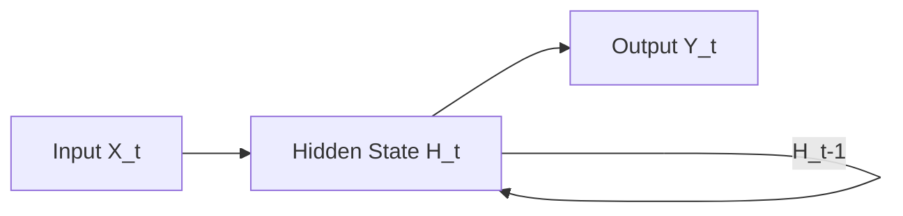

# Recurrent Neural Networks (RNN) - A Conceptual Guide

## What is an RNN?
A **Recurrent Neural Network (RNN)** is a type of artificial neural network designed to recognize patterns in sequences of data, such as text, genomes, handwriting, or the spoken word.

Unlike traditional Feedforward Neural Networks (which process inputs independently), RNNs have a "memory" which captures information about what has been calculated so far.

## Key Concept: The Loop
The core idea is that the output of a layer is fed back into the input of the same layer for the next time step.

At each time step $t$:
1.  **Input**: The network takes the current input $x_t$ and the previous hidden state $h_{t-1}$.
2.  **Process**: It calculates the new hidden state $h_t$.
3.  **Output**: It (optionally) produces an output $y_t$.

## The Math (Simplified)
$$ h_t = \tanh(W_h h_{t-1} + W_x x_t + b) $$

- $W_h$: Weight matrix for the hidden state (memory).
- $W_x$: Weight matrix for the current input.
- $\tanh$: Activation function to keep values between -1 and 1.

## Why are they useful?
They can handle inputs of varying lengths!
- **One-to-One**: Standard Neural Net (Fixed input -> Fixed output).
- **One-to-Many**: Image Captioning (Image -> Sequence of words).
- **Many-to-One**: Sentiment Analysis (Sequence of words -> Positive/Negative).
- **Many-to-Many**: Machine Translation (English sentence -> French sentence).

## The Problem: Short-term Memory
Basic RNNs suffer from the **Vanishing Gradient Problem**. As the sequence gets longer, it becomes hard for the network to learn dependencies from the beginning of the sequence.
*Solution*: **LSTM (Long Short-Term Memory)** and **GRU (Gated Recurrent Unit)** networks are advanced RNNs designed to remember long-term dependencies.
